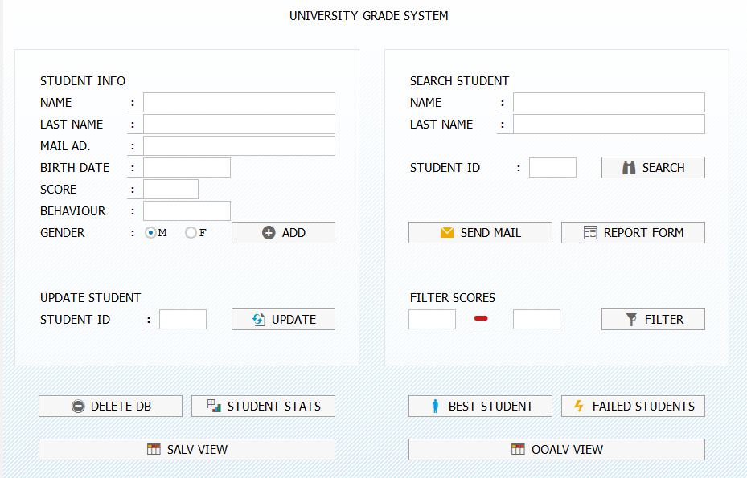
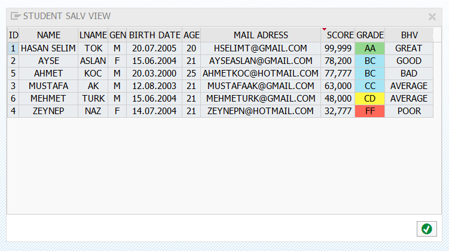
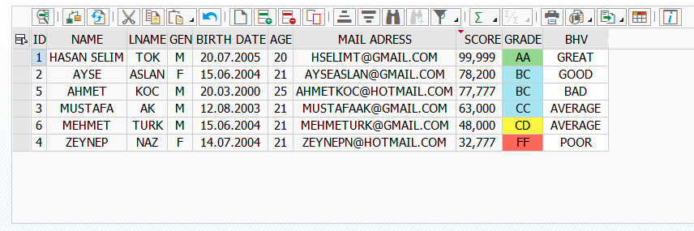
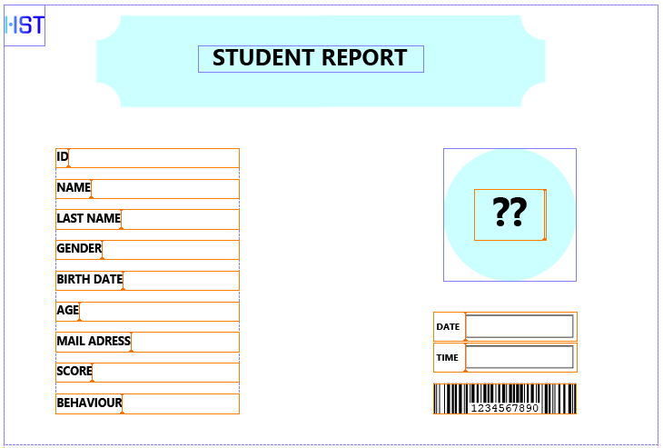

# 🎓 UNI-GRADE-SYSTEM

A fully operational university grade management system built in ABAP for SAP environments.

## ✨ Features

- **Student Management**: Add, update, search, and delete student records
- **Grade Conversion**: Automatic score-to-grade conversion (AA, AB, BB, BC, CC, CD, DD, FF)
- **Age Calculation**: Dynamic age calculation based on birth date
- **Email Notifications**: Send grade reports to individual students or bulk email to all
- **Failed Student Handling**: Special processing for failed students with grade recovery
- **Reporting**: Statistics, top student finder, and score-based filtering
- **Multiple Views**: Both SALV and OO ALV grid displays with color coding
- **Data Validation**: Input validation for dates, emails, and scores

## 🗄️ Database Architecture

### Custom Data Elements
| Element | Type | Length | Purpose |
|---------|------|--------|---------|
| `ZSTUDENTID_DE` | NUMC | 10 | Unique Student ID |
| `ZSTUDENTNAME_DE` | CHAR | 50 | First Name |
| `ZSTUDENTLNAME_DE` | CHAR | 50 | Last Name |
| `ZSTUDENTBDATE_DE` | DATS | 8 | Birth Date |
| `ZSTUDENTAGE_DE` | NUMC | 3 | Current Age |
| `ZSTUDENTMAIL_DE` | CHAR | 100 | Email Address |
| `ZSTUDENTGEN_DE` | CHAR | 1 | Gender (M/F) |
| `ZSTUDENT_SCORE_DE` | NUMC | 3 | Test Score (0-100) |
| `ZSTUDENT_GRADE_DE` | CHAR | 2 | Letter Grade (AA-FF) |
| `ZSTUDENTBHV_DE` | CHAR | 10 | Behaviour |

### Database Tables
- **`ZSTUDENT_T`** - Primary student records table
- **`ZFSTUDENT_T`** - Failed students tracking table
- **`ZBHVRULES`** - Table for search help

### Search Help
- **`ZSHSTUDENTBHV`** - Search help for student behaviour parameter

### Adobe Form
- **`ZUNI_GRADE_SYSTEM_AFORM`** - Adobe form
- **`ZUNI_GRADE_SYSTEM_INTERFACE`** - Adobe form interface

## 📊 Grade Scale

| Score Range | Grade |
|-------------|-------|
| 95-100      | AA    |
| 90-94       | AB    |
| 85-89       | BB    |
| 75-84       | BC    |
| 55-74       | CC    |
| 45-54       | CD    |
| 35-44       | DD    |
| 34-35       | DD    |
| 0-34        | FF    |
